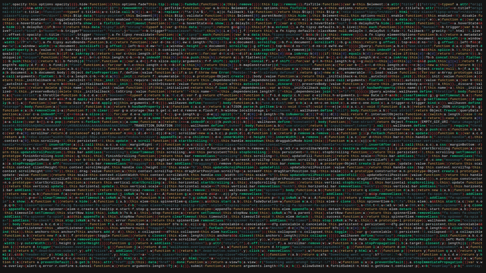

<h2 align='center'>Ahmed Kamel @ AhmedUKamel</h2>

<b>Computer Science Student</b>
 

<h2>👋 Hello!</h2>

 

<h2>💻 I'm Currently Studying on</h2>

- Faculty od Computers and Artificial Intelligence, Beni Suef University - Egypt

__Check out my GitHub repository:__

  

    
  

<h2>👀 Stats</h2>

<!--   

    <b><em>Now listening to:</em></b>  
    
  
 -->
  
  

  <b><em>GitHub Stats:</em></b>  
       
  

<h2>📫 How to reach me:</h2>

